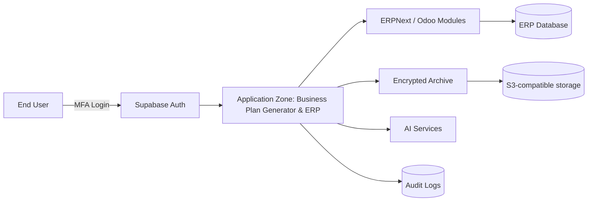
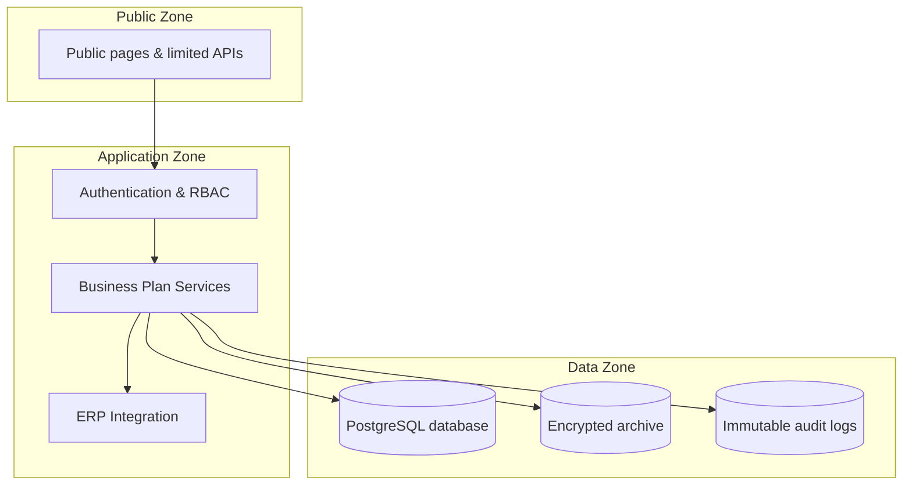

# 🔐 Open-Source Business Plan Ecosystem

**Data sovereignty • European privacy • Security by design**

**License:** Apache 2.0  
**GDPR Ready**  
**Security:** Zero Trust  

Prepared by **Andrews Fausto – Security professional and middleware architect candidate**

---

This project is the foundation for a trusted, sovereign and extensible AI-powered business planning platform.  
It is deliberately designed around open standards and open source to ensure that founders, advisors and investors can work together without being locked into any vendor.  

The emphasis is on **data sovereignty** and **privacy-by-design**, building on modern European legislation such as the **Data Act**, which gives users greater control over the data they generate and fosters fairness and competition in the cloud market.

---

## 1. Executive Summary

The current MVP demonstrates that a business plan generator can:

- Collect key information from founders  
- Draft professional plans with AI assistance  
- Allow advisors to comment  
- Export the result to a portable format  

The next step is to evolve this concept into a **platform that treats business planning as a living process** rather than a one-off document.

### Strategic Challenges
1. **Security & Privacy** – Confidential data must be protected via layered architecture, role-based access control, encryption, and immutable audit logs.  
2. **Data Sovereignty & Compliance** – Respect EU Data Act principles (portability, interoperability, protection from foreign access).  
3. **Open-Source Extensibility** – Modular stack, community-driven, Apache 2.0 licensed.  

---

## 2. Core Technical Architecture

The platform combines proven building blocks:

- **Middleware & database** – Supabase/PostgreSQL with MFA, RLS, and exportable schema  
- **ERP layer** – ERPNext/Odoo integration for accounting and project management  
- **Archive system** – Encrypted MinIO/Nextcloud for documents & unstructured data  
- **AI services** – Modular LLM integration with on-prem fallback for sensitive data  

### 2.1 Architecture Diagram

---

## 3. Security Concept

### 3.1 Three-Zone Model

- **Z1 – Public Zone**: Website, docs, limited APIs  
- **Z2 – Application Zone**: Auth, business plan generator, ERP connectors, AI middleware  
- **Z3 – Data Zone**: Database, encrypted object storage, audit logs  

### 3.2 Role-Based Access Control

| Role          | Responsibilities |
|---------------|------------------|
| **Founder**   | Creates & edits plans, invites advisors, initiates tasks |
| **Advisor**   | Reviews plans, comments, feedback |
| **Accountant**| Links tasks to cost centres, controls financial data |
| **Admin**     | Manages accounts, roles, integrations |

### 3.3 Encryption & Confidentiality
- TLS 1.3 for all traffic  
- AES-256 encryption at rest  
- Keys rotated and stored in vault  

### 3.4 Audit Logging & Accountability
- Append-only logs (logins, edits, AI generations, exports)  
- Timestamped & tamper-resistant  

### 3.5 Integrity & Monitoring
- Vulnerability monitoring  
- IDS (Fail2Ban), error monitoring (Sentry, Grafana)  
- SIEM integration supported  

---

## 4. European Data Protection & Sovereignty

- **EU Data Act (Sept 2025)** ensures:  
  - Control & portability  
  - Interoperability & fairness  
  - Protection from foreign access  

Our architecture embodies these principles with exportable open formats, modular ERP integrations, and EU-controlled infrastructure.

---

## 5. Open-Source Governance & Contribution

Released under **Apache 2.0**.  
Community-driven with transparent contributions.

### 5.1 Contribution Process
1. Fork & clone  
2. Open issue/proposal  
3. Branch & commit  
4. Pull Request with tests & docs  
5. Review & merge  

### 5.2 License Choice
- Default: **Apache 2.0**  
- Alternative: **AGPL** (stronger copyleft)  

---

## 6. Roles & Collaboration

- **Vision & Governance – Ursula**  
- **Security & Middleware Architect (Candidate) – Andrews Tallon**  
- **IT School & Developer Community** – Build modules under mentorship  
- **Industry Partners** – Validate use cases & requirements  

**Andrews’ proposed role includes:**
- Security planning & design  
- Implementation oversight  
- Compliance alignment  
- Training & mentoring  
- Continuous improvement

 ## 6.1 Middleware & Database Collaboration

A central requirement is to **organize the collaboration for middleware and databases in concrete terms**.  
The goal is not only to secure the data, but also to ensure that information flows seamlessly between modules (Business Plan Generator → Project Management → ERP/Accounting → Archive).

### Core Principles
- **Unified Database Backbone**  
  PostgreSQL (via Supabase) as the secure, extensible base layer. All business plans, comments, accounting data, and metadata flow into a controlled schema.
  
- **Open Middleware Connectors**  
  Edge functions and lightweight APIs to bridge systems (e.g., Business Plan Generator tasks → Project Management; Project Management costs → Odoo/ERPNext).  
  These connectors remain open-source so they can be adapted or replaced without lock-in.

- **Schema Extensions**  
  Support for specialized accounting/controlling fields (cost centers, cost units, project fields). Contributors can propose schema extensions via GitHub pull requests, subject to review for compliance and security.

- **Task & Data Flow Automation**  
  Tasks created in the Business Plan Generator are automatically:
  1. Written into the Project Management system.  
  2. Linked with corresponding cost centers and accounts.  
  3. Exported or mirrored into ERPNext/Odoo for financial control.  
  4. Archived in a sovereign, independent repository for long-term portability.

### Collaboration Model
- **Middleware Team** – builds and maintains connectors, ETL pipelines, and APIs.  
- **Database Team** – designs schemas, enforces migrations, reviews extensions.  
- **Security Review** – every schema change or middleware function is subject to RBAC checks, RLS enforcement, and audit logging.  

### Security Overlay
Even as multiple contributors work on middleware and databases:
- Data at rest remains AES-256 encrypted.  
- Transport is TLS-secured.  
- Role-based access ensures developers only see anonymized/test data when contributing.  
- Immutable audit logs guarantee traceability of all schema or connector changes.

---

Would you like me to go ahead and **patch this directly into your existing `security_proposal.md`** so your GitHub doc already reflects it?

---

## 7. Next Steps

- Publish GitHub repo (Apache 2.0 license)  
- Implement Supabase RLS/MFA, encrypted storage, audit logs  
- Build ERP + archive + plan generator reference prototype  
- Run Data Protection Impact Assessment (DPIA)  
- Community outreach (Estonian IT schools, GitHub, OSS forums)  

---

## References

1. [Data Act explained – Shaping Europe’s Digital Future](https://digital-strategy.ec.europa.eu/en/factpages/data-act-explained)  
2. [DMZ (computing) – Wikipedia](https://en.wikipedia.org/wiki/DMZ_(computing))  
3. [Access control – Wikipedia](https://en.wikipedia.org/wiki/Access_control)  
